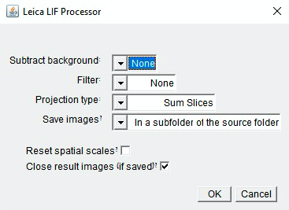

# Leica LIF Processor

### Video Presentation:

Coming soon...

### Description:

ImageJ macro that allows users to take a z-stack of .lif files from a Leica SP8 Conofocal Microscope and transform it into a z-projection (e.g. Min Intensity, Max Intensity) with channel split .tiff files. Users can also subtract background, use a filter (e.g. Sigma, Gaussian), and choose the output file path. After running the macro, a user gets the selected projections in each channel separately with little to no processing on their part.

MVP completed in 2 days as part of an image analysis automation project for the Hebrew University of Jerusalem's Interdepartmental Equipment Unit.

### Tech Stack:

Built using Vanilla JavaScript.

### Dev Team:

- Tal Luigi ([LinkedIn](https://www.linkedin.com/in/talluigi) | [GitHub](https://github.com/luigilegion))
- Daniel Waiger ([LinkedIn](https://www.linkedin.com/in/daniel-waiger-9433ab15a) | [GitHub](https://github.com/daniel-waiger))
